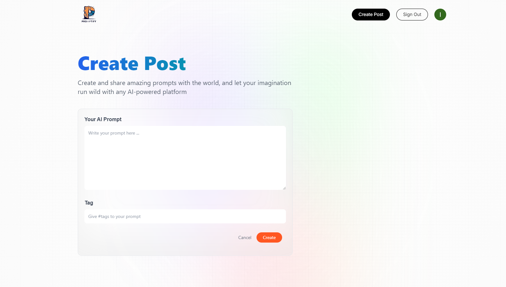

# Promptify

Promptify is an open-source AI prompting tool designed for the modern world to discover, create, and share creative prompts. It allows users to generate prompts that can be copied and pasted into AI platforms like ChatGPT. With features like tag-based searching, creator ID filtering, and Google authentication, Promptify offers a seamless experience for AI enthusiasts.




## Features

- **Prompt Creation:** Users can easily create prompts that can be used across AI platforms such as ChatGPT.
- **Search Functionality:** Search prompts by tags or the creator's ID to quickly find relevant prompts.
- **Google Authentication:** Secure user login and authorization using Google Auth.
- **Responsive Design:** A fully responsive UI built with Next.js, providing a smooth experience across devices.

## Tech Stack

- **Frontend & Backend:** Next.js
- **Authentication:** Google Auth
- **Database:** MongoDB
- **Styling:** Tailwind CSS

## Installation

To get a local copy up and running, follow these simple steps:

1. **Clone the repository:**

   ```sh
   git clone https://github.com/yourusername/promptify.git
   cd promptify

   ```

2. **Install dependencies:**

   ```sh
   npm install

   ```

3. **Install client dependencies:**

   ```sh
    cd ../client
    npm install

   ```

4. **Set up environment variables:**
   Create a .env file in the server directory and Add your environment variables (e.g., Google Auth credentials, database URL).

5. **Run the development server:**
   
   ```sh
   npm run dev

   ```
   Open your browser and navigate to http://localhost:3000 to see the app in action.
